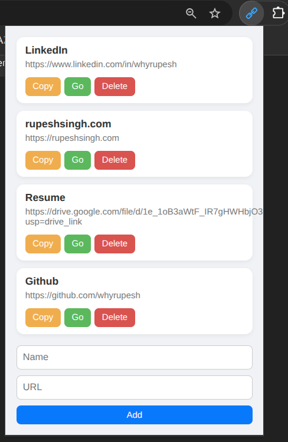

# Quick Links Chrome Extension

A simple and elegant Chrome Extension to manage and quickly access your favorite social or frequently used links.

## 🚀 Features

- Save links with custom names
- Copy link to clipboard with one click
- Open links in a new tab
- Delete links you no longer need
- Stylish, clean, and responsive UI
- Data is stored locally using Chrome Storage

---


## 📦 How to Use

1. **Download and Unzip**
   - [Download the ZIP](quick-links-extension.zip)
   - Unzip the folder to any location on your computer

2. **Load the Extension in Chrome**
   - Open Chrome and go to `chrome://extensions/`
   - Toggle **Developer Mode** (top-right corner)
   - Click **Load unpacked**
   - Select the unzipped folder containing the extension files

3. **Use the Extension**
   - Click the extension icon from your Chrome toolbar
   - Add a new link by entering a name and URL, then click **Add**
   - Click **Copy** to copy the link
   - Click **Go** to open it in a new tab
   - Click **Delete** to remove it

---

## 📁 File Structure

```
quick-links-extension/
├── manifest.json
├── popup.html
├── popup.css
├── popup.js
└── icons/ (you can add your own icons here)
```

## 🛠️ Tech Stack

- HTML, CSS, JavaScript
- Chrome Extension API (Manifest V3)

---

## 📌 Note

Make sure all URLs begin with `http://` or `https://`. If not, the extension automatically adds `https://` to ensure proper redirection.

---

## 🙌 Contribution

Feel free to fork and customize this extension as per your needs.

---

Made with ❤️ by Rupesh
